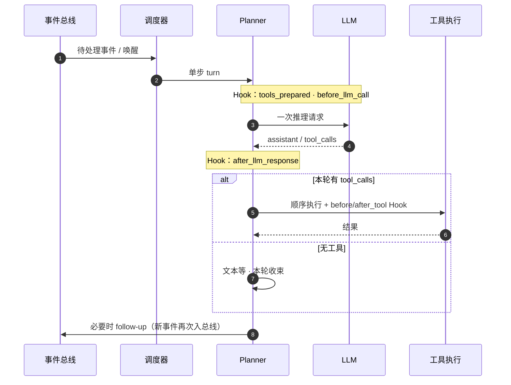

# FairyClaw

FairyClaw 是面向**后端长期运行**场景的异步 Agent 运行时：把会话调度、模型推理和能力扩展拆成清晰层次，让复杂任务在可并行、可恢复的前提下仍有一条**干净、可预期的主执行路径**。面向服务器部署场景，已打通端到端部署链路。




---

## 核心特点

**事件化与单步推进**
运行时事件驱动会话，Planner 以「单步推理 → 再唤醒」的方式推进，而不是把整条任务链塞进一次请求。主路径短、状态外显，便于观测、补偿与多会话隔离。

**能力组：先聚类，再路由**
能力不是零散工具名的集合，而是按**能力组（Capability Group）**成组声明：相关工具、Hook 与扩展约定放在同一组里。子 Agent 侧在组与组之间做路由选择——先按语义归桶，再在桶内启用工具集，把「选什么」从无穷工具名收敛到少量结构化决策。

**Skill 新范式**
Tool 负责「一次能调用什么」；Skill 负责「这一类事该怎么打」。Skill 把**可复用打法**做成一等公民——在 manifest 里用结构化 `steps` 声明规程，让模型在选工具、排顺序、何时收束上有明确抓手。

**干净执行路径 + 全面插件化**
核心编排保持精简、边界清楚；具体能力则尽量 manifest + 脚本落地：工具、技能、Turn Hook、运行时事件 Hook、以及自定义 `event_types` 等，都走注册与声明，而不是改 core 里的硬编码。

**双进程架构**
Business 进程（运行时 + Planner）与 Gateway 进程（用户侧 HTTP API / OneBot 适配器）通过内部 WebSocket 桥接通信，职责分离，Gateway 可独立扩展。

---

## 文档导航


| 文档                                                   | 内容                                                                |
| ---------------------------------------------------- | ----------------------------------------------------------------- |
| [AI_SYSTEM_GUIDE.md](AI_SYSTEM_GUIDE.md)             | **权威系统文档**：架构设计、事件模型、Hook 协议、Sub-Agent 机制、开发约定（AI 与人类开发者均可参考）     |
| [LAYOUT.md](LAYOUT.md)                               | 模块职责地图：每个目录与关键文件的职责一览                                             |
| [docs/GATEWAY_ENVELOPE.md](docs/GATEWAY_ENVELOPE.md) | Gateway–Business WebSocket 桥接信封协议：帧结构、生命周期、文件传输                   |
| [DEPLOY.md](DEPLOY.md)                               | 部署指南：Python venv、Docker Compose、systemd、Web UI 与 OneBot/NapCat 配置 |
| [CONTRIBUTING.md](CONTRIBUTING.md)                   | 贡献指南：能力组扩展入口、Hook 边界类型、manifest 结构                                |


---

## 快速开始

```bash
# 1. 安装
python3 -m venv .venv && source .venv/bin/activate
pip install -e .

# 2. 配置
cp config/fairyclaw.env.example config/fairyclaw.env
cp config/llm_endpoints.yaml.example config/llm_endpoints.yaml
# 编辑两个文件，填入 LLM API 地址、token 等

# 3. 启动 Business 进程
uvicorn fairyclaw.main:app --host 0.0.0.0 --port 8000

# 4. 启动 Gateway 进程（另一个终端）
uvicorn fairyclaw.gateway.main:app --host 0.0.0.0 --port 8081
```

详细步骤（Docker、systemd、Web UI、OneBot/NapCat 接入）请参阅 [DEPLOY.md](DEPLOY.md)。

---

## 扩展能力

最快的扩展方式是在 `fairyclaw/capabilities/` 下新增一个能力组目录：

```
fairyclaw/capabilities/my_group/
├── manifest.json    ← 声明工具、Skill、Hook
└── scripts/
    └── my_tool.py   ← 工具实现
```

Hook 边界类型、manifest 字段约定与完整示例参见 [CONTRIBUTING.md](CONTRIBUTING.md)。

---

## License

[MIT](LICENSE) © 2026 FairyClaw contributors, PKU DS Lab