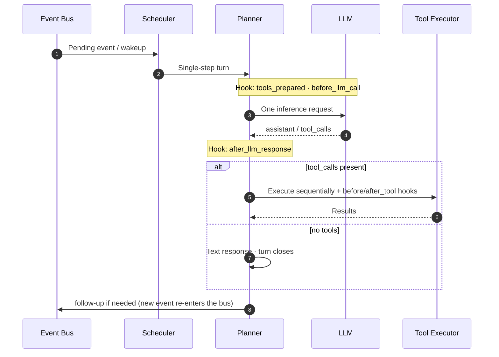

# FairyClaw

FairyClaw is an async agent runtime for **long-running server-side deployments**. It separates session scheduling, LLM inference, and capability extension into clear layers so work can run in parallel and resume safely, while keeping a **short, observable main execution path**.

---

## Quick Start

### Install from PyPI

```bash
python3 -m venv .venv
source .venv/bin/activate   # Windows: .venv\Scripts\activate
pip install fairyclaw
```

### Optional: install from a git checkout

```bash
git clone https://github.com/PKULab1806/FairyClaw.git
cd FairyClaw
python3 -m venv .venv && source .venv/bin/activate
pip install -e .
```

### Run

```bash
# Matches the profile in config/llm_endpoints.yaml (see FAIRYCLAW_LLM_* / api_key_env)
export OPENAI_API_KEY="your_key_here"

fairyclaw start
```

`fairyclaw start` builds the web UI (unless `--skip-build`), then starts **Business** + **Gateway**:

| | Default |
|---|--------|
| Business | `http://0.0.0.0:16000` (internal; `/healthz`, bridge WebSocket) |
| Gateway + Web UI | `http://0.0.0.0:8081` — open **`http://127.0.0.1:8081/app`** on the same machine |
| Stale listeners on those ports | Stopped automatically unless you pass **`--no-kill-stale`** |

**Config and data**

| Layout | Config directory | State root (data, logs, writable capabilities) |
|--------|------------------|-----------------------------------------------|
| **PyPI / no `./config` in cwd** | **`~/.fairyclaw/config`** (or **`$FAIRYCLAW_HOME/config`**) | **`~/.fairyclaw/`** — paths like `./data` and `./capabilities` in `fairyclaw.env` resolve under this tree |
| **Git clone** (usual dev) | **`./config`** when that folder exists in the current working directory | Parent of `config/` (often the repo root) |

Override config location with **`FAIRYCLAW_CONFIG_DIR`** if needed.
Defaults for `FAIRYCLAW_DATA_DIR`, `FAIRYCLAW_DATABASE_URL`, `FAIRYCLAW_CAPABILITIES_DIR`, and `FAIRYCLAW_LOG_FILE_PATH` are derived from that same root (`<root>/data`, `<root>/data/fairyclaw.db`, `<root>/capabilities`, `<root>/data/logs/fairyclaw.log`).

Set **`FAIRYCLAW_API_TOKEN`** before startup if you do not want the default dev token for WebSocket auth.

More deployment options: [DEPLOY.md](DEPLOY.md). To embed a fresh frontend in the wheel: `python scripts/prepare_web_dist.py` then `python -m build`.

---

## Key features

| | |
|---|---|
| **Event-driven steps** | Sessions advance on runtime events. The Planner does **one inference step → re-wakeup** instead of one giant request, so the main path stays short and easy to trace. |
| **Capability groups** | Capabilities are not a flat tool list. Related tools, Hooks, and extensions ship as a **group**. Sub-agents **cluster** similar groups, then **route** into one bucket and enable that tool set. |
| **Built-in workflows** | Groups can encode multi-tool pipelines (e.g. **SourcedResearch**: search → excerpt → citations) so delegated work stays verifiable instead of free-form claims. |
| **Plugins, not core edits** | Tools, turn Hooks, runtime Hooks, and custom `event_types` register through **manifest + scripts**, not hard-coded core. |
| **Two processes** | **Business** (runtime + Planner) and **Gateway** (web `/v1/ws`, OneBot, etc.) talk over an internal WebSocket bridge so you can scale or swap the Gateway independently. |

---

## Updating capability groups

Commands are the same for everyone; **where files land** depends on how you run FairyClaw.

### After `pip install` (typical user)

With no `./config` in your current directory, cold start uses **`~/.fairyclaw/config`** and resolves **`./capabilities`**, **`./data`**, etc. under **`~/.fairyclaw/`**.

```bash
# Add missing groups from the installed package seed (skip groups you already changed)
fairyclaw capabilities sync

# Overwrite from the package seed (backups by default; use --dry-run / --group to narrow)
fairyclaw capabilities upgrade
```

Edit the tree under **`~/.fairyclaw/capabilities/`** (or the path in **`FAIRYCLAW_CAPABILITIES_DIR`** in `fairyclaw.env`).

### Git clone / monorepo (developer)

Point **`FAIRYCLAW_CAPABILITIES_DIR`** at the repo seed, e.g. **`./fairyclaw/capabilities`**, in `config/fairyclaw.env`. Run the same CLI from the repo (or anywhere, if **`FAIRYCLAW_CONFIG_DIR`** is set):

```bash
fairyclaw capabilities sync
fairyclaw capabilities upgrade --group my_group   # example
```

Cold start and `fairyclaw start` still materialize or skip groups per seed rules; see [CONTRIBUTING.md](CONTRIBUTING.md) for manifest schema and Hook boundaries.

---

## Documentation

Keep **[AI_SYSTEM_GUIDE.md](AI_SYSTEM_GUIDE.md)** and this **README** aligned when you change gateway surfaces, bridge behavior, or control-plane events.

| Document | Contents |
|---|---|
| [AI_SYSTEM_GUIDE.md](AI_SYSTEM_GUIDE.md) | **Canonical system reference**: architecture, events, Hooks, sub-agents, dev conventions |
| [README.md](README.md) | **Overview**, quick start, capability paths |
| [LAYOUT.md](LAYOUT.md) | Module map: directories and key files |
| [docs/GATEWAY_ENVELOPE.md](docs/GATEWAY_ENVELOPE.md) | Gateway–Business bridge: frames, lifecycle, files |
| [fairyclaw/core/gateway_protocol/GATEWAY_RUNTIME_PROTOCOL.md](fairyclaw/core/gateway_protocol/GATEWAY_RUNTIME_PROTOCOL.md) | Control envelopes and web `/v1/ws` push shapes |
| [DEPLOY.md](DEPLOY.md) | venv, Docker, systemd, Web UI, OneBot/NapCat |
| [CONTRIBUTING.md](CONTRIBUTING.md) | Extending capability groups: manifests, Hooks, examples |

---

## Extending capabilities

In the **repository**, seed groups live under **`fairyclaw/capabilities/`**. At runtime, the loader reads **`FAIRYCLAW_CAPABILITIES_DIR`** (writable tree). Minimal layout:

```text
my_group/
├── manifest.json
└── scripts/
    └── my_tool.py
```

Details: [CONTRIBUTING.md](CONTRIBUTING.md).

---

## Execution loop (diagram)

How a single Planner turn interacts with the bus, LLM, and tools:



---

## License

[MIT](LICENSE) © 2026 FairyClaw contributors, PKU DS Lab
