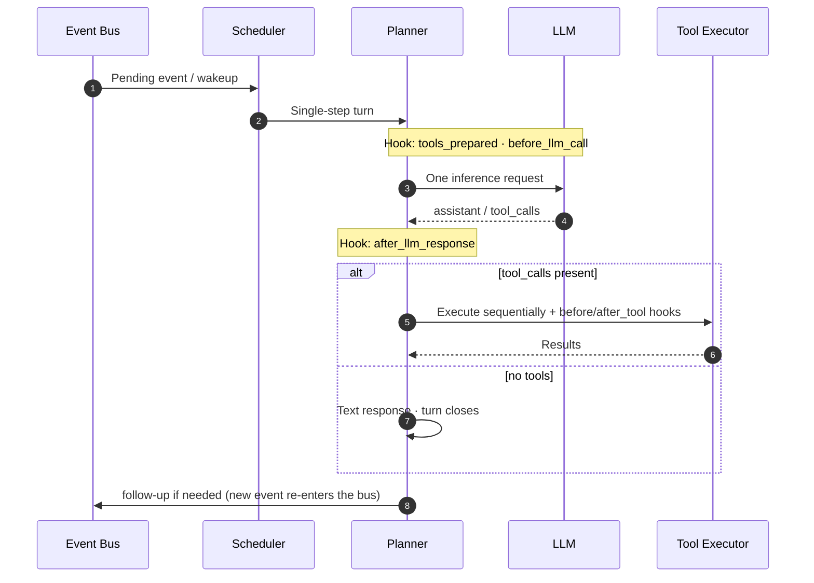

# FairyClaw

FairyClaw is an async agent runtime built for **long-running server-side deployments**. It structures session scheduling, LLM inference, and capability extension into clear layers, so complex tasks can run in parallel and be resumed — while still following a **clean, predictable main execution path**.



---

## Key Features

**Event-driven, single-step advancement**
Sessions are driven by runtime events. The Planner advances via a "one inference step → re-wakeup" loop rather than stuffing an entire task chain into a single request. The main path stays short and observable, making multi-session isolation, compensation, and monitoring straightforward.

**Capability Groups: cluster first, route second**
Capabilities are not a flat list of tool names. Related tools, Hooks, and extensions are declared together as a **Capability Group**. Sub-agents route between groups — first bucketing semantically similar capabilities, then enabling the tool set within the chosen bucket — collapsing "what to pick" from an unbounded tool list into a small set of structured decisions.

**New Skill paradigm**
Tools own "what can be called in one invocation"; Skills own "how to approach this class of task". Skills elevate reusable playbooks to first-class citizens — structured `steps` declared in the manifest give the model clear guidance on tool selection, ordering, and termination conditions.

**Clean execution path + full plugin architecture**
The core orchestration stays lean and well-bounded. Concrete capabilities are delivered via manifest + script: tools, skills, Turn Hooks, runtime event Hooks, and custom `event_types` are all registered declaratively rather than hard-coded in core.

**Dual-process architecture**
The Business process (runtime + Planner) and the Gateway process (user-facing HTTP API / OneBot adapters) communicate over an internal WebSocket bridge. Responsibilities are cleanly separated; the Gateway can scale or be replaced independently.

---

## Documentation

| Document | Contents |
|---|---|
| [AI_SYSTEM_GUIDE.md](AI_SYSTEM_GUIDE.md) | **Canonical system reference**: architecture, event model, Hook protocol, Sub-Agent mechanics, development conventions (useful for both AI assistants and human developers) |
| [LAYOUT.md](LAYOUT.md) | Module responsibility map: every directory and key file at a glance |
| [docs/GATEWAY_ENVELOPE.md](docs/GATEWAY_ENVELOPE.md) | Gateway–Business WebSocket bridge protocol: frame structure, lifecycle, file transfer |
| [DEPLOY.md](DEPLOY.md) | Deployment guide: Python venv, Docker Compose, systemd, Web UI, OneBot/NapCat setup |
| [CONTRIBUTING.md](CONTRIBUTING.md) | Contribution guide: capability group extension, Hook boundary types, manifest schema |

---

## Quick Start

```bash
# 1. Install
python3 -m venv .venv && source .venv/bin/activate
pip install -e .

# 2. Configure
cp config/fairyclaw.env.example config/fairyclaw.env
cp config/llm_endpoints.yaml.example config/llm_endpoints.yaml
# Edit both files: set your LLM API endpoint, tokens, etc.

# 3. Start the Business process
uvicorn fairyclaw.main:app --host 0.0.0.0 --port 8000

# 4. Start the Gateway process (separate terminal)
uvicorn fairyclaw.gateway.main:app --host 0.0.0.0 --port 8081
```

For detailed steps — Docker, systemd, Web UI, OneBot/NapCat integration — see [DEPLOY.md](DEPLOY.md).

---

## Extending Capabilities

The fastest way to extend FairyClaw is to add a capability group directory under `fairyclaw/capabilities/`:

```
fairyclaw/capabilities/my_group/
├── manifest.json    ← declare tools, skills, hooks
└── scripts/
    └── my_tool.py   ← tool implementation
```

For Hook boundary types, manifest field conventions, and complete examples, see [CONTRIBUTING.md](CONTRIBUTING.md).

---

## License

[MIT](LICENSE) © 2026 FairyClaw contributors, PKU DS Lab
